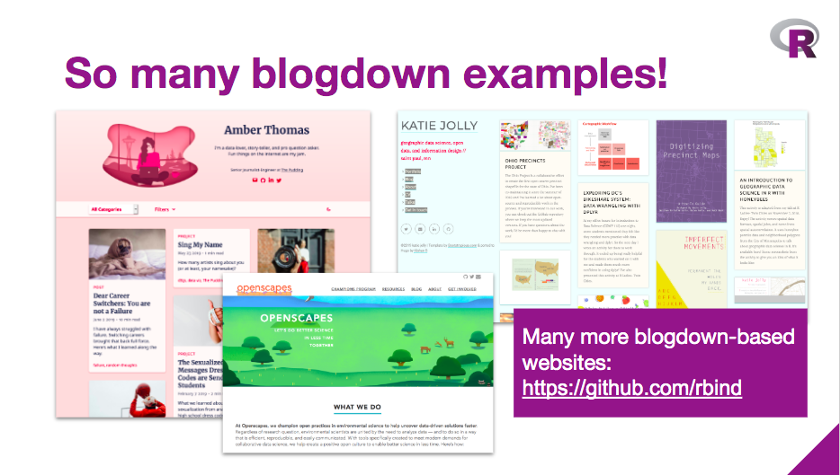
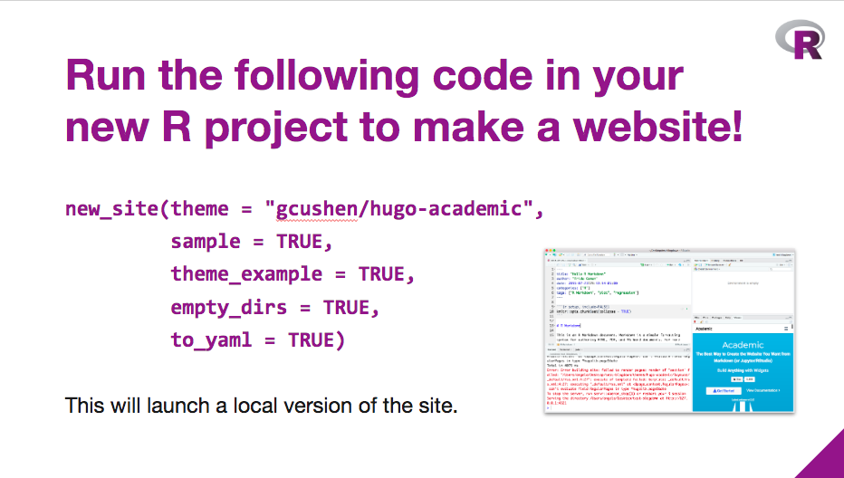
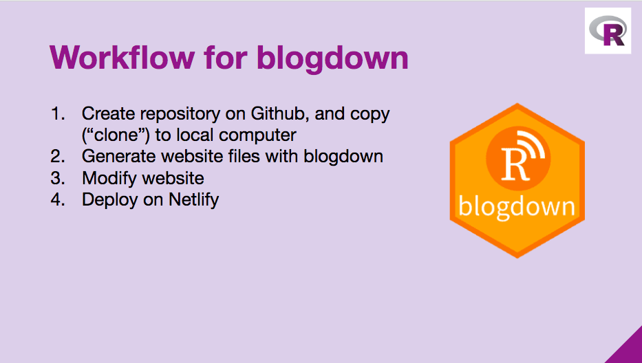
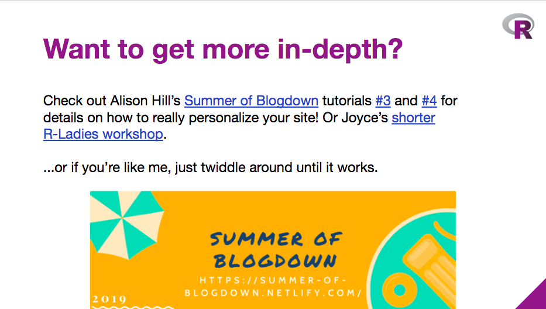

# 2019-09-24-blogdown-workshop

Materials for [Sept 24 blogdown workshop](https://www.meetup.com/rladies-chicago/events/264595913/) for R-Ladies Chicago

This workshop is more of a web development in R workshop than a data science in R workshop - you'll find that there are only a few functions in blogdown that we use, and the rest is about file organization, and putting things in the right place to make a properly formatted website with blogdown. If you've come here for data analysis, I'll warn you that you've come to the wrong place!

## Used during R-Ladies Chicago workshop

* [Google Slides](https://docs.google.com/presentation/d/1eQooAomuDflV60C9W32BgK6XQkqqYOzWOv3Q2pNxsP4/edit?usp=sharing) for the workshop ([PDF version](https://github.com/rladies-chicago/2019-09-24-blogdown-workshop/blob/master/2019-09-24-blogdown-workshop.pdf) in here if you want to download)

* [R Code from the workshop](https://github.com/rladies-chicago/2019-09-24-blogdown-workshop/blob/master/blogdown-workshop.R)

## Additional resources
 
* [Summer of Blogdown](https://summer-of-blogdown.netlify.com): really great set of resources to go through for a comprehensive overview of blogdown
* [R-Ladies RTP Blogdown Workshop](https://rpubs.com/joycecahoon/blogdown-intro): workshop off of which this one is based 
* [Blogdown book](https://bookdown.org/yihui/blogdown/get-started.html): comprehensive documentation of everything blogdown, can be hard to read at times
